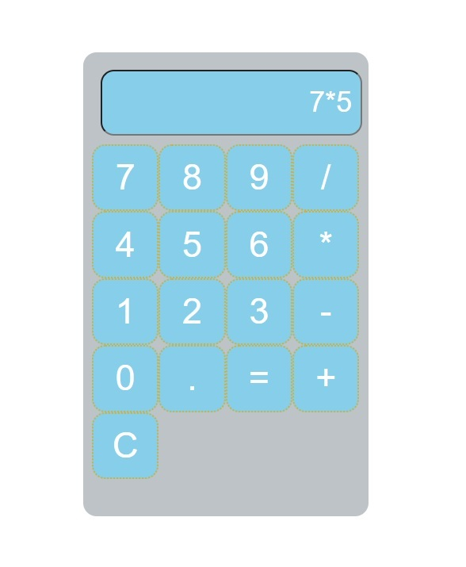

# 🧮 Calculator App

A simple and responsive calculator built to perform everyday arithmetic operations. This project was created to practice programming fundamentals, user interface design, and event handling.

## ✨ Features

- ➕ Addition
- ➖ Subtraction
- ✖️ Multiplication
- ➗ Division
- 🧹 Clear button to reset calculations
- 📱 Responsive design for desktop and mobile
- ⚡ Fast and easy-to-use interface

## 🛠️ Technologies Used

- HTML5
- CSS3
- JavaScript

## 🚀 Getting Started

1. Clone this repository:

   ```bash
   git clone https://github.com/your-username/calculator-app.git
   ```

2. Navigate to the project folder:

   ```bash
   cd calculator-app
   ```

3. Open `index.html` in your web browser.

No additional installation or dependencies are required.

## 📂 Project Structure

```
calculator-app/
│── index.html
│── style.css
│── script.js
└── README.md
```

## 🎯 Future Improvements

- Scientific calculator functions
- Keyboard input support
- Calculation history
- Dark/Light mode toggle
- Percentage and square root functions

## 📸 Screenshot

   

## 🤝 Contributing

Contributions, suggestions, and improvements are welcome. Feel free to fork the repository and submit a pull request.

## 📄 License

This project is licensed under the MIT License.

## 👨‍💻 Author

Created by John Mitchell
